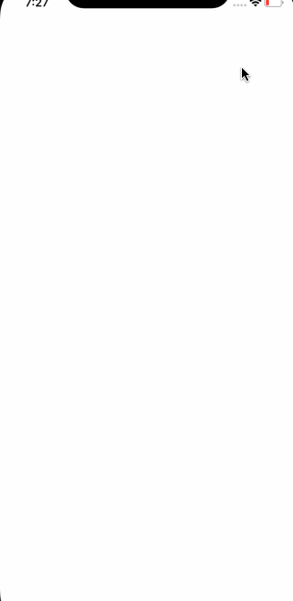

# SampleApp-MVVM

This is an example project to demonstrate dependency injection using SwinInject.

Value binding done through RxSwift.

Kingfisher Library used to show the User profile images.

## Requirements

- Xcode 8.0 or later
- Min Deployment Target - iOS 10

## Setup

1. Download the source code or clone the repository.
2. Goto Project Directory through terminal
3. Run pod install
4. Open 'SampleApp.xcworkspace'
5. Run the app

